# O PENSADOR - Biblioteca de Diagramas
## Templates Mermaid para Processos de Decisao

Este arquivo contem templates de diagramas que complementam o agente O Pensador v5.0.
Quando o usuario solicitar diagramas sobre processos de decisao, utilize estes templates como base.

---

## 1. DIAGRAMA PRINCIPAL - Processo de Decisao Completo (7 Fases)

```mermaid
flowchart TB
    START([INICIO:<br/>Situacao Requer Decisao]) --> IDENTIFY

    subgraph FASE1["FASE 1: IDENTIFICACAO E ENQUADRAMENTO"]
        IDENTIFY["Identificar o Problema<br/>Qual e a real questao?<br/>Sintoma vs. Causa Raiz"]
        DEFINE["Definir Escopo<br/>Limites do problema<br/>Stakeholders envolvidos"]
        URGENCY{"E urgente<br/>E importante?"}

        IDENTIFY --> DEFINE
        DEFINE --> URGENCY
    end

    URGENCY -->|"Sim:<br/>Matriz Eisenhower<br/>Quadrante 1"| FAST_TRACK["Fast Track:<br/>Decisao Imediata<br/>com dados disponiveis"]
    URGENCY -->|"Nao:<br/>Tempo para<br/>analise profunda"| GATHER

    subgraph FASE2["FASE 2: COLETA DE INFORMACOES"]
        GATHER["Coletar Dados<br/>Fatos objetivos<br/>Opinioes qualificadas<br/>Precedentes historicos"]
        SOURCES{"Fontes sao<br/>confiaveis e<br/>suficientes?"}
        MORE_DATA["Buscar Mais Dados<br/>Pesquisa adicional<br/>Consulta a especialistas<br/>Dados empiricos"]

        GATHER --> SOURCES
        SOURCES -->|"Nao"| MORE_DATA
        MORE_DATA --> SOURCES
        SOURCES -->|"Sim"| ANALYZE
    end

    subgraph FASE3["FASE 3: ANALISE E GERACAO DE ALTERNATIVAS"]
        ANALYZE["Analisar Informacoes<br/>Padroes e tendencias<br/>Relacoes causais<br/>Lacunas de conhecimento"]
        GENERATE["Gerar Alternativas<br/>Brainstorming<br/>Pensamento lateral<br/>Minimo 3 opcoes viaveis"]
        CREATIVE{"Alternativas<br/>incluem opcoes<br/>criativas?"}
        EXPAND["Expandir Espaco de Solucoes<br/>Questionar pressupostos<br/>Combinar alternativas<br/>Pensar fora da caixa"]

        ANALYZE --> GENERATE
        GENERATE --> CREATIVE
        CREATIVE -->|"Nao"| EXPAND
        EXPAND --> GENERATE
        CREATIVE -->|"Sim"| CRITERIA
    end

    subgraph FASE4["FASE 4: AVALIACAO DE CRITERIOS"]
        CRITERIA["Definir Criterios<br/>Eficacia (atinge objetivo?)<br/>Viabilidade (recursos)<br/>Etica (valores)<br/>Risco (consequencias)"]
        WEIGHT["Ponderar Criterios<br/>Importancia relativa<br/>Trade-offs explicitos"]
        SCORE["Pontuar Alternativas<br/>Matriz de decisao<br/>Scoring sistematico"]
        MULTI["Analise Multi-Criterio<br/>RICE Score<br/>Arvore de decisao<br/>Cenarios prospectivos"]

        CRITERIA --> WEIGHT
        WEIGHT --> SCORE
        SCORE --> MULTI
        MULTI --> BEST
    end

    subgraph FASE5["FASE 5: ESCOLHA E VALIDACAO"]
        BEST{"Alternativa<br/>claramente<br/>superior?"}
        CLOSE["Empate Tecnico<br/>Usar intuicao informada<br/>Phronesis (sabedoria pratica)<br/>Valores pessoais/organizacionais"]
        DECIDE["DECISAO TOMADA"]
        REVERSIBLE{"Decisao e<br/>reversivel?"}
        SAFE["Implementar com<br/>Acompanhamento"]
        VERIFY["Validacao Adicional<br/>Teste piloto<br/>Simulacao<br/>Consulta final"]

        BEST -->|"Sim"| DECIDE
        BEST -->|"Nao"| CLOSE
        CLOSE --> DECIDE
        DECIDE --> REVERSIBLE
        REVERSIBLE -->|"Sim:<br/>Baixo risco"| SAFE
        REVERSIBLE -->|"Nao:<br/>Alto impacto"| VERIFY
        VERIFY --> PLAN
        SAFE --> PLAN
    end

    subgraph FASE6["FASE 6: PLANEJAMENTO E IMPLEMENTACAO"]
        PLAN["Planejar Implementacao<br/>Acoes especificas<br/>Responsaveis<br/>Timeline<br/>Recursos necessarios"]
        EXECUTE["Executar Plano<br/>Comunicar decisao<br/>Mobilizar recursos<br/>Iniciar acoes"]
        MONITOR["Monitorar Execucao<br/>KPIs definidos<br/>Checkpoints regulares<br/>Ajustes taticos"]

        PLAN --> EXECUTE
        EXECUTE --> MONITOR
    end

    subgraph FASE7["FASE 7: FEEDBACK E APRENDIZAGEM"]
        RESULTS["Avaliar Resultados<br/>Objetivos alcancados?<br/>Efeitos colaterais?<br/>Licoes aprendidas"]
        SUCCESS{"Decisao<br/>foi bem-sucedida?"}
        LEARN["Documentar Aprendizado<br/>O que funcionou<br/>O que nao funcionou<br/>Como melhorar"]
        ADJUST["Ajustar ou Reverter<br/>Corrigir curso<br/>Implementar Plano B<br/>Voltar a Fase 3"]
        KNOWLEDGE["Atualizar Base<br/>de Conhecimento<br/>PKM System<br/>Proximas decisoes"]

        MONITOR --> RESULTS
        RESULTS --> SUCCESS
        SUCCESS -->|"Sim"| LEARN
        SUCCESS -->|"Parcial ou Nao"| ADJUST
        ADJUST --> GENERATE
        LEARN --> KNOWLEDGE
    end

    FAST_TRACK --> EXECUTE
    KNOWLEDGE --> END([FIM:<br/>Ciclo de Melhoria Continua])

    classDef phaseStyle fill:#E3F2FD,stroke:#1976D2,stroke-width:3px,color:#000
    classDef processStyle fill:#C8E6C9,stroke:#388E3C,stroke-width:2px,color:#000
    classDef decisionStyle fill:#FFF9C4,stroke:#F57C00,stroke-width:2px,color:#000
    classDef criticalStyle fill:#FFCCBC,stroke:#D84315,stroke-width:2px,color:#000
    classDef successStyle fill:#B2DFDB,stroke:#00796B,stroke-width:2px,color:#000
    classDef startEndStyle fill:#E1BEE7,stroke:#7B1FA2,stroke-width:3px,color:#000

    class IDENTIFY,DEFINE,GATHER,ANALYZE,GENERATE,CRITERIA,WEIGHT,SCORE,MULTI,PLAN,EXECUTE,MONITOR,RESULTS,LEARN processStyle
    class URGENCY,SOURCES,CREATIVE,BEST,REVERSIBLE,SUCCESS decisionStyle
    class FAST_TRACK,VERIFY,ADJUST criticalStyle
    class DECIDE,SAFE,KNOWLEDGE successStyle
    class START,END startEndStyle
```

---

## 2. VERSAO SIMPLIFICADA (Para Apresentacoes)

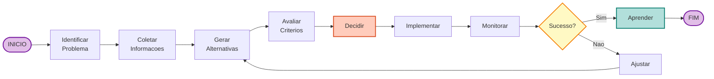

---

## 3. DIAGRAMA COM SWIMLANES (Responsabilidades)

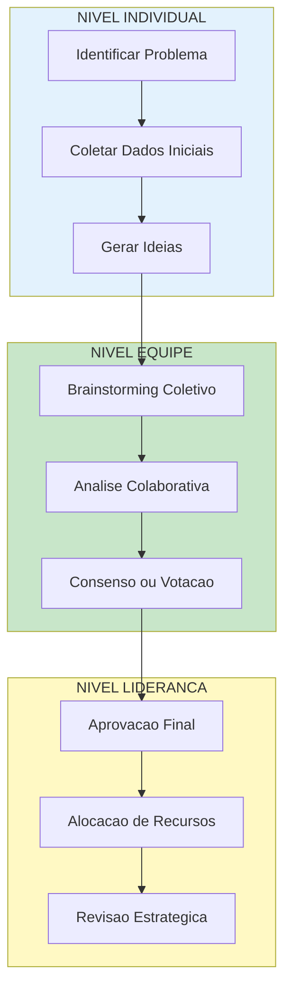

---

## 4. DECISAO ETICA (Filosofia Aplicada)

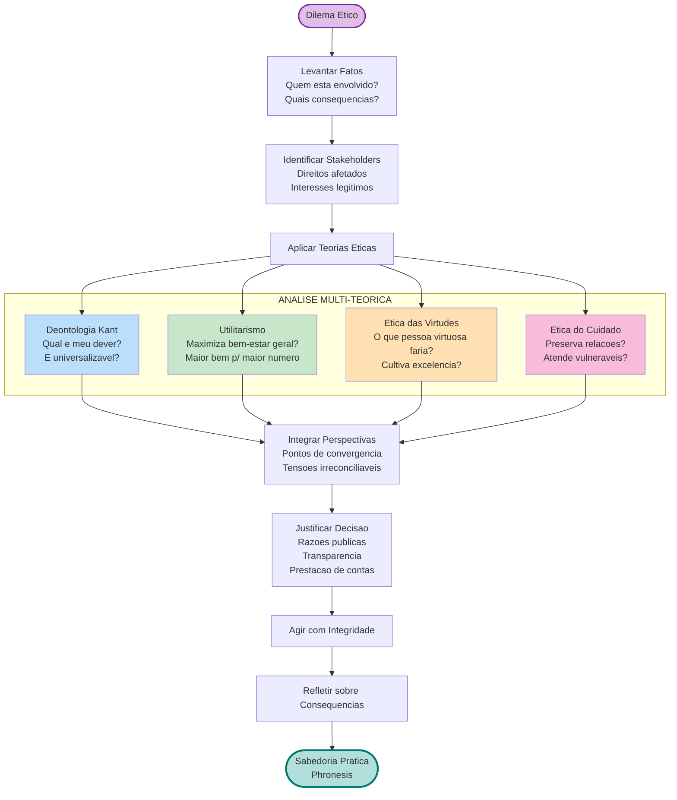

---

## 5. MIND MAP - Processo de Decisao

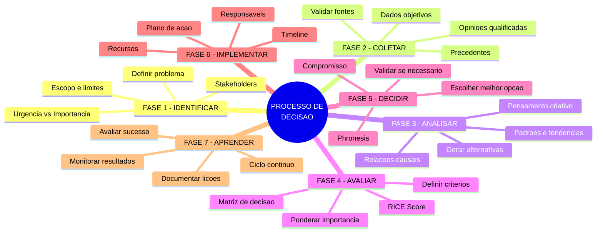

---

## 6. QUADRANT CHART - Matriz Eisenhower

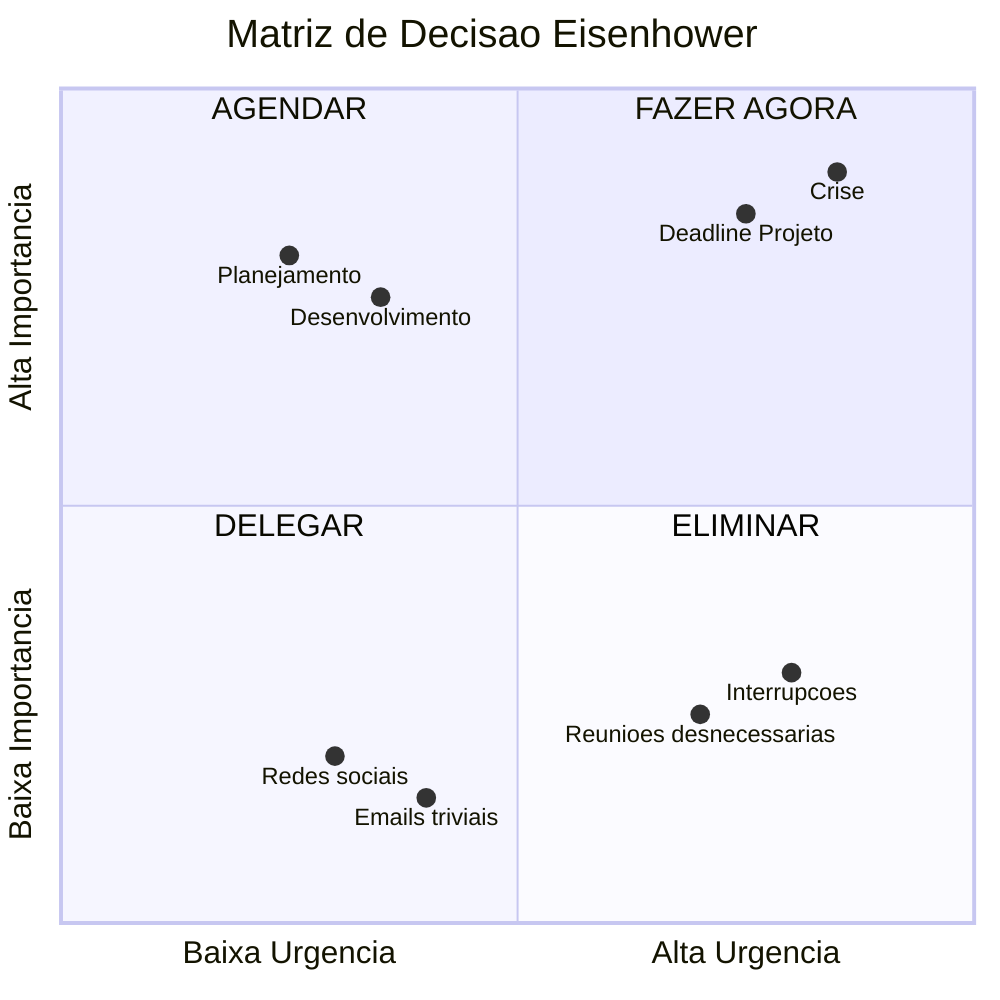

---

## FRAMEWORK TEORICO

Este conjunto de diagramas integra:

| Origem | Conceito Aplicado |
|--------|------------------|
| Herbert Simon | Racionalidade limitada, satisficing |
| Daniel Kahneman | Sistema 1 (intuitivo) e Sistema 2 (analitico) |
| Aristoteles | Phronesis (sabedoria pratica) |
| Matriz Eisenhower | Urgencia vs. Importancia |
| RICE Framework | Priorizacao sistematica |
| Chess.h.AI | Pensamento N-jogadas a frente |
| Ciclo PDCA | Plan-Do-Check-Act (Deming) |
| Etica Aplicada | Multi-perspectiva normativa |

---

## COMO USAR ESTES DIAGRAMAS

1. **Copie o codigo Mermaid** e cole em:
   - Obsidian (com plugin Mermaid)
   - GitHub/GitLab (suporte nativo)
   - Notion (via embed)
   - VS Code (com extensao Mermaid)
   - https://mermaid.live/ (editor online)

2. **Personalize conforme necessario:**
   - Adicione/remova etapas
   - Ajuste cores e estilos
   - Adapte ao seu contexto especifico

3. **Export para apresentacoes:**
   - Via Mermaid.live: SVG, PNG, PDF
   - Via Kroki API: multiplos formatos

---

## 7. ARQUITETURA DE SOFTWARE - Visao Geral do Sistema

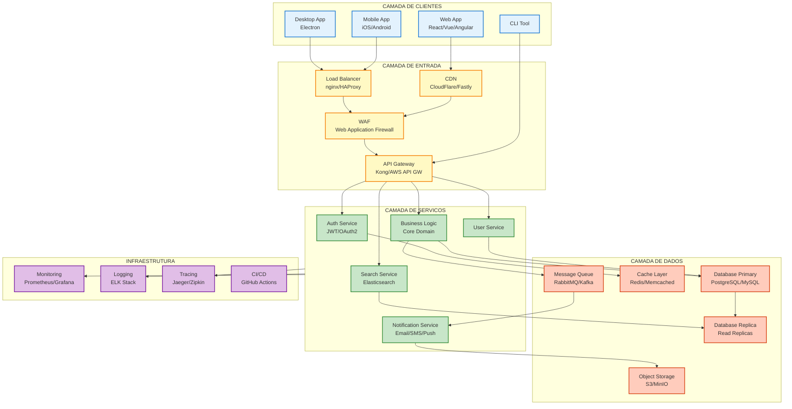

---

## 8. ARQUITETURA MICROSERVICES

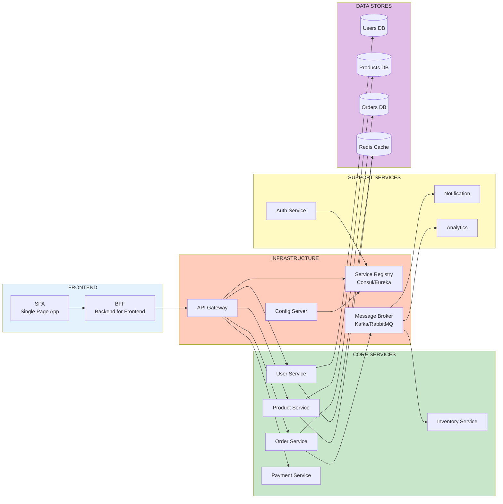

---

## 9. ARQUITETURA HEXAGONAL (Ports & Adapters)

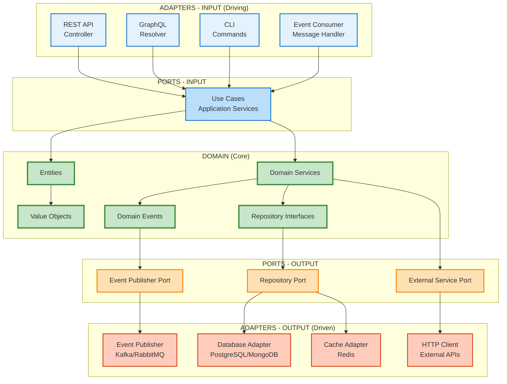

---

## 10. ARQUITETURA C4 MODEL - Context Diagram

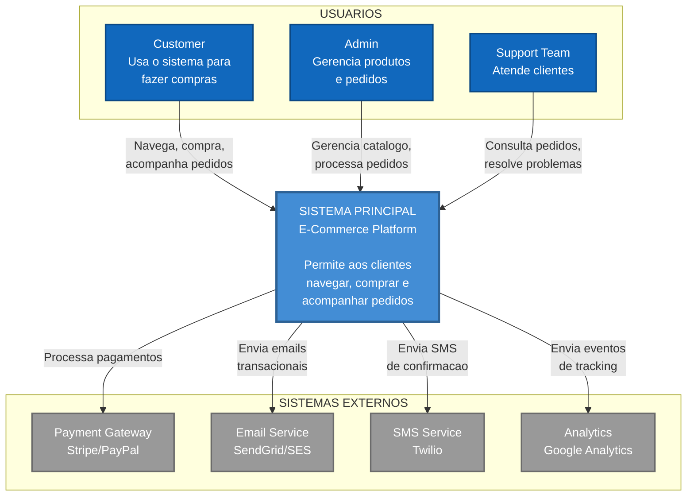

---

## 11. ARQUITETURA CLEAN ARCHITECTURE (Camadas)

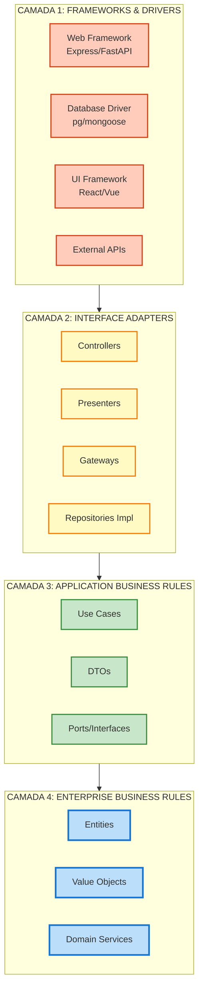

---

## 12. ARQUITETURA EVENT-DRIVEN

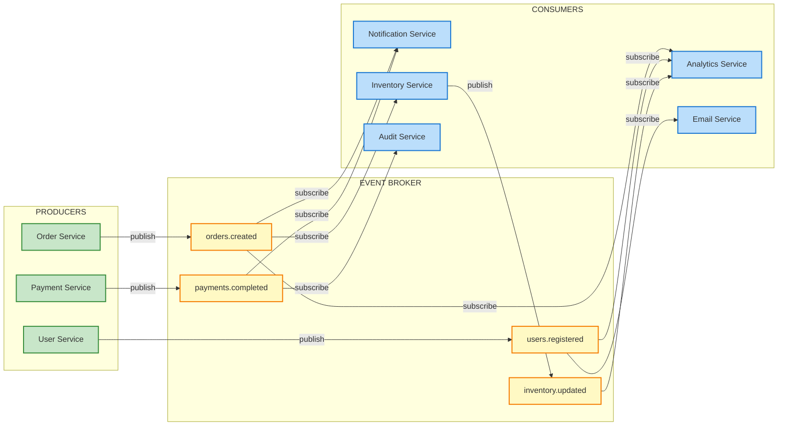

---

## 13. MIND MAP - Arquitetura de Software

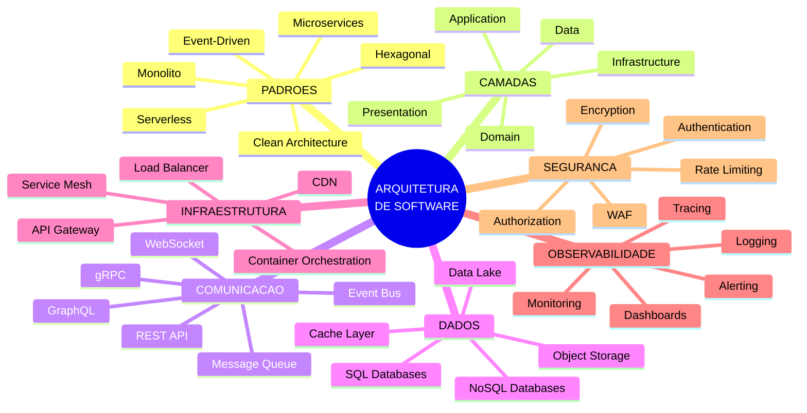

---

## REFERENCIAS DE ARQUITETURA

| Padrao | Quando Usar |
|--------|-------------|
| **Monolito** | MVPs, equipes pequenas, dominios simples |
| **Microservices** | Escala, equipes independentes, dominios complexos |
| **Hexagonal** | Testabilidade, inversao de dependencia |
| **Clean Architecture** | Separacao de concerns, longevidade |
| **Event-Driven** | Desacoplamento, processamento assincrono |
| **Serverless** | Cargas variaveis, custos por uso |
| **C4 Model** | Documentacao, comunicacao com stakeholders |

---

*Arquivo gerado por O Pensador v5.0 - Arquiteto do Pensamento Profundo*
