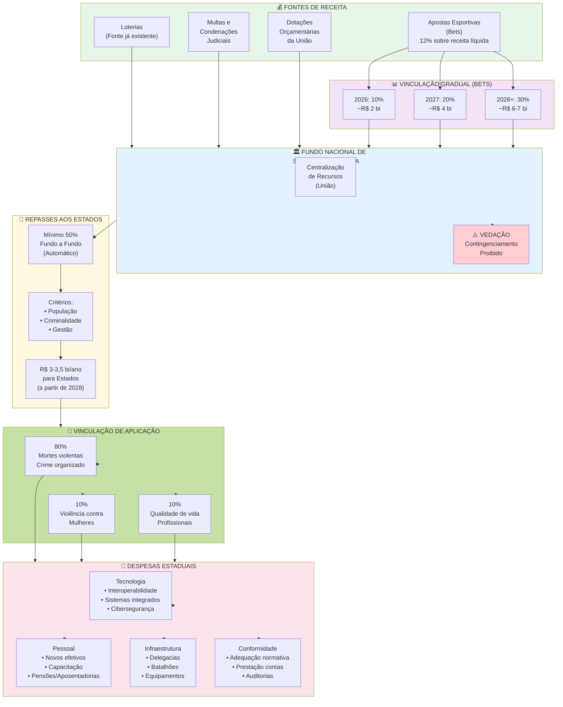
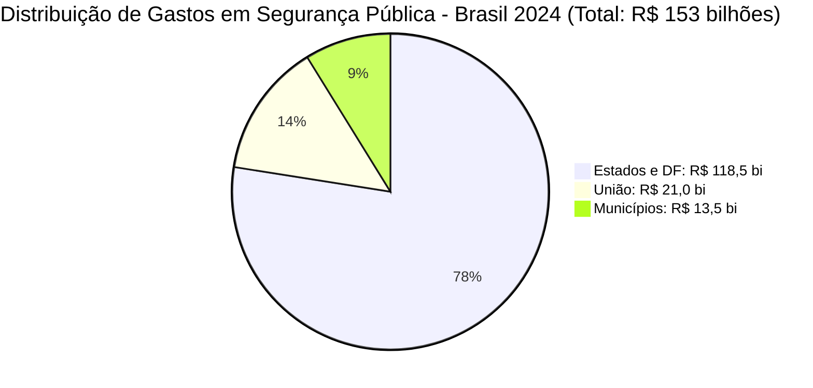
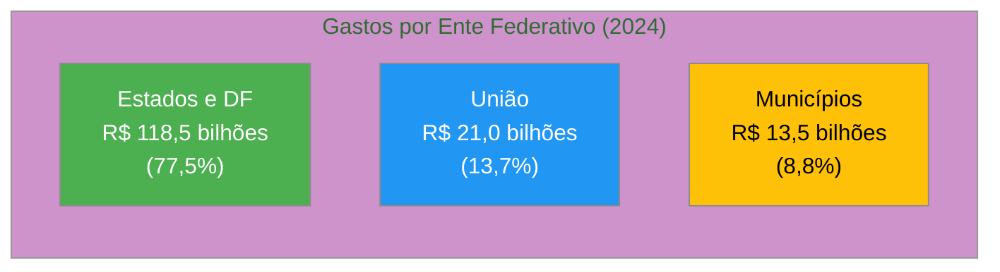
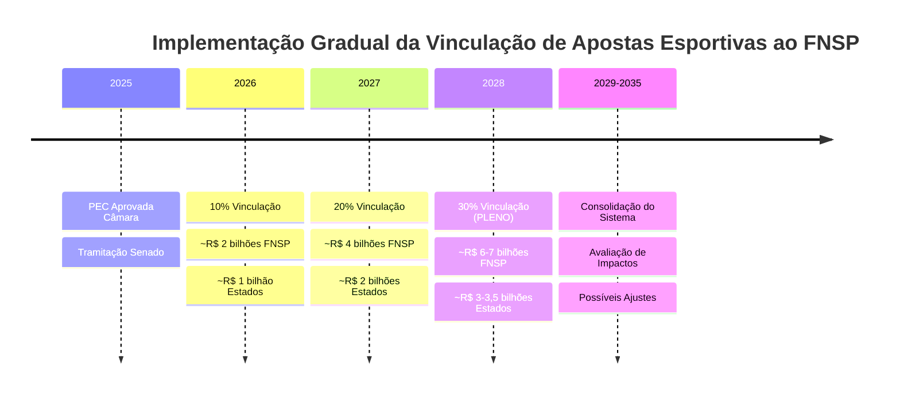
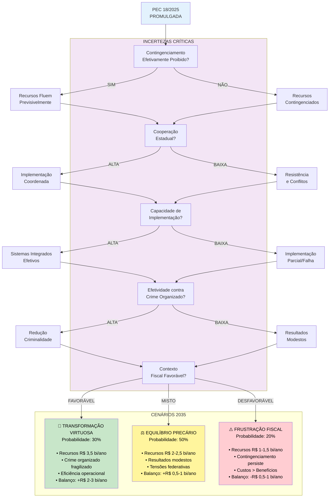
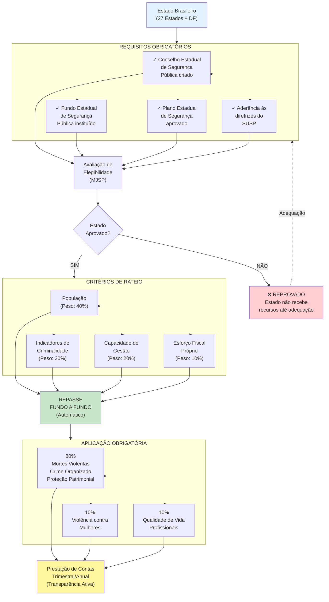
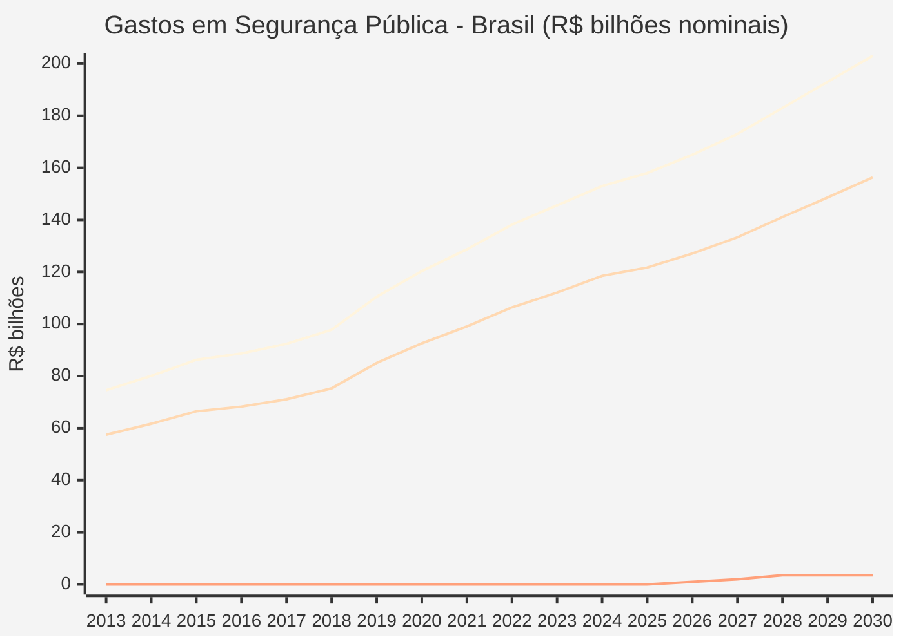

# MELHORIAS SUBSTANTIVAS PARA O ARTIGO: PEC DA SEGURANÇA PÚBLICA (PEC 18/2025)

## DOCUMENTO DE APRIMORAMENTO ACADÊMICO

**Autor**: O Pensador - Sistema de Inteligência Filosófica
**Data**: 6 de março de 2026
**Objetivo**: Fornecer adições teóricas, visualizações e conclusões aprimoradas para inserção direta no artigo acadêmico

---

# PARTE 1: APROFUNDAMENTO TEÓRICO POR SEÇÃO

## SEÇÃO 2: REFERENCIAL TEÓRICO - ADIÇÕES TEÓRICAS

### 2.1 FEDERALISMO FISCAL - Ampliação Teórica

#### Teorias Clássicas do Federalismo Fiscal

**Inserir após o segundo parágrafo da Seção 2.1:**

A teoria do federalismo fiscal possui raízes na obra seminal de **Charles Tiebout (1956)**, que formulou o modelo da "votação com os pés" (*voting with their feet*), segundo o qual a descentralização fiscal promove eficiência ao permitir que cidadãos escolham jurisdições cujo mix de tributação e serviços públicos melhor atenda suas preferências. Este modelo, embora idealizado, fundamenta argumentos em favor da autonomia subnacional.

**Wallace Oates (1972)**, em seu teorema da descentralização, estabelece que, na ausência de economias de escala e externalidades interjurisdicionais, a provisão descentralizada de bens públicos é sempre mais eficiente que a centralizada, pois permite melhor ajuste às preferências locais. Oates (1999) posteriormente reconheceu limitações deste teorema, especialmente em contextos de desigualdades regionais acentuadas e capacidade institucional heterogênea – características marcantes do federalismo brasileiro.

**Musgrave (1959)** identifica três funções clássicas do Estado em economias federativas: (1) **alocativa** (provisão eficiente de bens públicos), (2) **distributiva** (redução de desigualdades) e (3) **estabilizadora** (políticas macroeconômicas anticíclicas). O autor argumenta que a função estabilizadora deve ser centralizada (governo federal), enquanto as funções alocativa e distributiva podem combinar elementos centralizados e descentralizados. No caso da segurança pública brasileira, a predominância estadual reflete ênfase na função alocativa, mas a PEC 18/2025 propõe reequilíbrio através de coordenação federal.

**Referências a Adicionar:**

MUSGRAVE, R. A. **The theory of public finance**: a study in public economy. New York: McGraw-Hill, 1959.

OATES, W. E. **Fiscal federalism**. New York: Harcourt Brace Jovanovich, 1972.

OATES, W. E. An essay on fiscal federalism. **Journal of Economic Literature**, v. 37, n. 3, p. 1120-1149, 1999.

TIEBOUT, C. M. A pure theory of local expenditures. **Journal of Political Economy**, v. 64, n. 5, p. 416-424, 1956.

---

#### O Dilema da Coordenação em Sistemas Federativos

**Inserir ao final da Seção 2.1:**

O federalismo fiscal contemporâneo enfrenta o que **Rodden (2006)** denomina de "**common pool problem**" (problema dos recursos comuns): quando múltiplas jurisdições compartilham bases tributárias ou dependem de transferências federais, há incentivos para comportamento fiscal irresponsável (*free-riding*), com entes subnacionais transferindo custos para o governo central. Este problema é particularmente agudo em federações como o Brasil, onde estados dependem significativamente de transferências constitucionais (FPE) e recursos vinculados.

**Weingast (2009)** analisa o conceito de **"federalismo que preserva mercado"** (*market-preserving federalism*), caracterizado por: (a) hierarquia de governos com autonomia em suas esferas; (b) mercado comum sem barreiras internas; (c) restrição orçamentária rígida (*hard budget constraint*) para entes subnacionais. O autor argumenta que, quando governos subnacionais não enfrentam restrições orçamentárias rígidas (por exemplo, quando há expectativa de resgates federais), a disciplina fiscal se deteriora. A PEC 18/2025, ao vincular receitas de apostas constitucionalmente, pode enfraquecer restrições orçamentárias, gerando risco moral.

No contexto brasileiro, **Alston et al. (2016)** demonstram que o federalismo fiscal é marcado por **barganha política contínua** entre União e estados, com períodos alternados de centralização (anos 1990, ajuste fiscal) e descentralização (pós-Constituição de 1988). A PEC da Segurança insere-se neste movimento pendular, representando centralização parcial através de coordenação obrigatória.

**Referências a Adicionar:**

ALSTON, L. J.; MELO, M. A.; MUELLER, B.; PEREIRA, C. **Brazil in transition**: beliefs, leadership, and institutional change. Princeton: Princeton University Press, 2016.

RODDEN, J. **Hamilton's paradox**: the promise and peril of fiscal federalism. Cambridge: Cambridge University Press, 2006.

WEINGAST, B. R. Second generation fiscal federalism: the implications of fiscal incentives. **Journal of Urban Economics**, v. 65, n. 3, p. 279-293, 2009.

---

### 2.2 SEGURANÇA PÚBLICA COMO POLÍTICA PÚBLICA - Ampliação Teórica

#### Economia Política da Segurança Pública

**Inserir após o quarto parágrafo da Seção 2.2:**

A análise econômica da criminalidade, inaugurada por **Gary Becker (1968)**, modela o comportamento criminoso como escolha racional: indivíduos comparam benefícios esperados do crime com custos esperados (probabilidade de captura × severidade da punição + custos de oportunidade). Esta perspectiva sugere que políticas de segurança devem focar tanto em aumentar probabilidade de captura (eficiência policial) quanto em reduzir incentivos ao crime (políticas sociais, mercado de trabalho).

**Levitt (1997)** demonstrou empiricamente, para o caso dos Estados Unidos, que aumento de efetivos policiais reduz criminalidade, mas com retornos marginais decrescentes. Mais relevante, o autor identificou que melhorias qualitativas na gestão policial (uso de dados, policiamento orientado a problemas) têm impacto superior ao mero incremento quantitativo de efetivos. Este achado é crucial para avaliar a PEC 18/2025: recursos adicionais apenas reduzirão violência se acompanhados de modernização de gestão.

**Fajnzylber, Lederman e Loayza (2002)**, em análise abrangente de determinantes da criminalidade em países em desenvolvimento, identificam que desigualdade de renda, urbanização acelerada, fragilidade institucional e impunidade são preditores mais robustos de taxas de homicídio que gastos policiais *per se*. Isto sugere que a efetividade da PEC dependerá de políticas complementares de redução de desigualdades e fortalecimento institucional.

**Referências a Adicionar:**

BECKER, G. S. Crime and punishment: an economic approach. **Journal of Political Economy**, v. 76, n. 2, p. 169-217, 1968.

FAJNZYLBER, P.; LEDERMAN, D.; LOAYZA, N. Inequality and violent crime. **Journal of Law and Economics**, v. 45, n. 1, p. 1-39, 2002.

LEVITT, S. D. Using electoral cycles in police hiring to estimate the effect of police on crime. **American Economic Review**, v. 87, n. 3, p. 270-290, 1997.

---

#### Teorias de Governança de Segurança Pública

**Inserir ao final da Seção 2.2:**

A literatura contemporânea de segurança pública migrou do paradigma tradicional de "law and order" para abordagens de **governança colaborativa** e **segurança cidadã**. **Bayley e Shearing (2001)** argumentam que o Estado não pode monopolizar a produção de segurança, devendo articular-se com comunidades, setor privado e sociedade civil em redes de co-produção.

**Goldstein (1990)** desenvolveu o conceito de **policiamento orientado a problemas** (*problem-oriented policing*), que propõe análise sistemática de padrões criminais, identificação de causas subjacentes e intervenções adaptadas. Este modelo exige capacidade analítica, interoperabilidade de dados e flexibilidade operacional – justamente os objetivos da constitucionalização do SUSP.

**Sherman et al. (1997)**, em revisão sistemática de evidências sobre "o que funciona" em prevenção ao crime, concluem que: (a) policiamento baseado em evidências é mais efetivo que intuição ou tradição; (b) foco em hot spots (áreas críticas) gera maior retorno; (c) programas preventivos comunitários têm custo-benefício superior a encarceramento massivo. Estas evidências sugerem que a PEC deve priorizar investimentos em tecnologia, análise de dados e prevenção, não apenas em efetivos e infraestrutura prisional.

**Johnston e Shearing (2003)** analisam a transição de modelos de "governo da segurança" (*government of security*) para "governança da segurança" (*governance of security*), caracterizada por multiplicidade de atores, horizontalidade de relações e ênfase em resultados. A PEC 18/2025, ao criar Conselho Nacional paritário e estimular forças-tarefa multiníveis, alinha-se a esta tendência, mas enfrenta resistências culturais de instituições tradicionalmente hierárquicas e insuladas.

**Referências a Adicionar:**

BAYLEY, D. H.; SHEARING, C. D. The new structure of policing: description, conceptualization, and research agenda. Washington, DC: National Institute of Justice, 2001.

GOLDSTEIN, H. **Problem-oriented policing**. New York: McGraw-Hill, 1990.

JOHNSTON, L.; SHEARING, C. **Governing security**: explorations in policing and justice. London: Routledge, 2003.

SHERMAN, L. W. et al. **Preventing crime**: what works, what doesn't, what's promising. Washington, DC: National Institute of Justice, 1997.

---

### 2.3 FINANCIAMENTO DA SEGURANÇA PÚBLICA - Ampliação Teórica

#### Teoria da Escolha Pública e Vinculação de Receitas

**Inserir após o segundo parágrafo sobre "Arrecadação de Apostas Esportivas":**

A vinculação constitucional de receitas é analisada criticamente pela **Teoria da Escolha Pública** (*Public Choice Theory*). **Buchanan e Wagner (1977)** argumentam que vinculações reduzem flexibilidade orçamentária, impedindo realocação eficiente de recursos conforme mudanças de prioridades. Em contextos de múltiplas vinculações (como o brasileiro, onde educação, saúde e, agora, segurança competem por receitas vinculadas), há risco de engessamento fiscal.

Por outro lado, **Wildavsky (1964)**, em análise clássica sobre processo orçamentário, reconhece que vinculações podem ser justificadas quando: (a) há risco de subfinanciamento crônico de políticas com benefícios difusos e de longo prazo; (b) existe problema de credibilidade governamental, necessitando compromisso institucional. Ambas condições aplicam-se à segurança pública brasileira, historicamente subfinanciada pelo governo federal e sujeita a contingenciamentos.

**Rodden e Wibbels (2010)** identificam que, em federações fiscalmente descentralizadas, transferências condicionadas (*conditional grants*) são instrumentos eficazes de alinhamento a prioridades nacionais, mas devem equilibrar indução federal com preservação de autonomia local. A PEC 18/2025, ao estabelecer vinculações de aplicação (80% mortes violentas, 10% mulheres, 10% profissionais), opera precisamente nesta lógica, mas arrisca inadequação às heterogeneidades estaduais.

**Referências a Adicionar:**

BUCHANAN, J. M.; WAGNER, R. E. **Democracy in deficit**: the political legacy of Lord Keynes. New York: Academic Press, 1977.

RODDEN, J.; WIBBELS, E. Fiscal decentralization and the business cycle: an empirical study of seven federations. **Economics & Politics**, v. 22, n. 1, p. 37-67, 2010.

WILDAVSKY, A. **The politics of the budgetary process**. Boston: Little, Brown and Company, 1964.

---

### 2.4 RELAÇÕES INTERGOVERNAMENTAIS - Ampliação Teórica

#### Federalismo Cooperativo versus Federalismo Competitivo

**Inserir ao final da Seção 2.4:**

A literatura sobre federalismo identifica dois modelos ideais-típicos: **federalismo competitivo** (entes subnacionais competem por investimentos, eficiência, inovação) e **federalismo cooperativo** (coordenação através de pactos, conselhos, transferências condicionadas). **Riker (1964)**, em obra fundacional, argumenta que federalismo pressupõe competição entre níveis de governo, garantindo checks and balances e inovação institucional.

**Scharpf (1988)** distingue entre **federalismo executivo** (coordenação através de cúpulas de executivos) e **federalismo legislativo** (coordenação através de câmaras federativas). O Brasil combina elementos de ambos: o Senado representa estados, mas governadores exercem influência direta sobre bancadas federais. A PEC 18/2025 fortalece o federalismo executivo ao criar Conselho Nacional onde governadores participam diretamente de decisões nacionais.

**Pierson (1995)** analisa problemas de **ação coletiva** em sistemas federativos: quando benefícios de cooperação são difusos (segurança nacional contra crime organizado) mas custos são concentrados (despesas estaduais), há incentivos ao *free-riding*. Mecanismos de coordenação compulsória (como constitucionalização do SUSP) podem resolver este problema, mas geram resistências políticas de entes que se percebem como financiadores líquidos da cooperação.

**Elazar (1987)** introduz o conceito de **"federalismo pactual"** (*covenantal federalism*), no qual relações intergovernamentais baseiam-se em confiança, reciprocidade e compromissos mútuos, não apenas em hierarquia ou competição. A efetividade da PEC 18/2025 dependerá criticamente da construção desta dimensão pactual: se estados perceberem a coordenação como imposição unilateral da União, resistirão; se perceberem como pacto mutuamente vantajoso, cooperarão.

**Referências a Adicionar:**

ELAZAR, D. J. **Exploring federalism**. Tuscaloosa: University of Alabama Press, 1987.

PIERSON, P. Fragmented welfare states: federal institutions and the development of social policy. **Governance**, v. 8, n. 4, p. 449-478, 1995.

RIKER, W. H. **Federalism**: origin, operation, significance. Boston: Little, Brown, 1964.

SCHARPF, F. W. The joint-decision trap: lessons from German federalism and European integration. **Public Administration**, v. 66, n. 3, p. 239-278, 1988.

---

## SEÇÃO 3: A PEC DA SEGURANÇA PÚBLICA - Adições Teóricas

### 3.3 INOVAÇÕES NORMATIVAS - Ampliação Teórica

**Inserir ao final da Seção 3.3:**

#### Constitucionalização de Políticas Públicas: Riscos e Benefícios

A inserção de políticas públicas no texto constitucional é fenômeno analisado pela literatura de **direito constitucional comparado** e **economia institucional**. **Elkins, Ginsburg e Melton (2009)** demonstram que constituições mais longas e detalhadas tendem a ser menos duráveis, pois exigem emendas frequentes para adaptação a mudanças contextuais. A Constituição brasileira de 1988, com mais de 100 emendas em 36 anos, exemplifica este padrão.

**Tushnet (2008)** distingue entre **constitucionalismo aspiracional** (princípios gerais e direitos fundamentais) e **constitucionalismo específico** (detalhamento de políticas e programas). O autor argumenta que o segundo tipo, embora confira estabilidade a políticas no curto prazo, reduz flexibilidade adaptativa e pode engessar inovação. A PEC 18/2025, ao constitucionalizar o SUSP, vinculações de receita, composição de conselho e competências operacionais, aproxima-se do constitucionalismo específico, com suas virtudes (estabilidade, garantia de recursos) e vícios (rigidez, dificuldade de ajuste).

**Ackerman (2000)** analisa o fenômeno de **"momentos constitucionais"** (*constitutional moments*), nos quais crises ou consensos suprapartidários viabilizam grandes reformas. A aprovação da PEC com 461 votos na Câmara (quórum de 90%) sugere constituir momento constitucional, impulsionado por percepção de crise de segurança e consenso sobre necessidade de coordenação federal. Contudo, Ackerman alerta que reformas em momentos de crise podem incorporar soluções subótimas, posteriormente difíceis de reverter.

**Referências a Adicionar:**

ACKERMAN, B. The new separation of powers. **Harvard Law Review**, v. 113, n. 3, p. 633-729, 2000.

ELKINS, Z.; GINSBURG, T.; MELTON, J. **The endurance of national constitutions**. Cambridge: Cambridge University Press, 2009.

TUSHNET, M. **Weak courts, strong rights**: judicial review and social welfare rights in comparative constitutional law. Princeton: Princeton University Press, 2008.

---

## SEÇÃO 4: IMPACTOS FISCAIS NOS ESTADOS - Adições Teóricas

### 4.4 RISCOS E OPORTUNIDADES FISCAIS - Ampliação Teórica

**Inserir ao final da Seção 4.4.2:**

#### Teoria dos Bens Públicos e Externalidades Interjurisdicionais

A segurança pública configura exemplo paradigmático de **bem público com externalidades interjurisdicionais**. **Oates (2005)** demonstra que, quando bens públicos geram spillovers entre jurisdições, a provisão descentralizada resulta em suboferta (*underprovision*), pois cada jurisdição não internaliza benefícios gerados para outras. No caso da segurança, a mobilidade de criminosos entre estados cria externalidade negativa: investimentos em policiamento em um estado podem deslocar crime para estados vizinhos ("efeito deslocamento"), reduzindo incentivos ao investimento.

A literatura sobre **crime organizado transnacional** (NAÍM, 2006; LESSING, 2017) enfatiza que organizações como PCC, Comando Vermelho e facções regionais operam em múltiplos estados e países, explorando fragmentação institucional. **Lessing (2017)**, em análise sobre facções brasileiras, demonstra que a expansão territorial de grupos criminosos correlaciona-se com fragilidade de coordenação entre forças policiais estaduais. A constitucionalização do SUSP, ao impor interoperabilidade e forças-tarefa, busca internalizar externalidades e fechar brechas institucionais exploradas pelo crime organizado.

**Benson (1998)** analisa economia política do policiamento, argumentando que fragmentação jurisdicional pode, paradoxalmente, ser eficiente quando gera competição por "qualidade de segurança" entre municípios/estados. Contudo, o autor reconhece que esta lógica aplica-se a crimes locais (furtos, roubos), não a crime organizado que requer coordenação supralocal. A PEC 18/2025, portanto, busca equilíbrio: manter competição em crimes locais (preservando autonomia estadual) enquanto impõe coordenação em criminalidade transjurisdicional.

**Referências a Adicionar:**

BENSON, B. L. **To serve and protect**: privatization and community in criminal justice. New York: NYU Press, 1998.

LESSING, B. **Making peace in drug wars**: crackdowns and cartels in Latin America. Cambridge: Cambridge University Press, 2017.

NAÍM, M. **Illicit**: how smugglers, traffickers, and copycats are hijacking the global economy. New York: Doubleday, 2006.

OATES, W. E. Toward a second-generation theory of fiscal federalism. **International Tax and Public Finance**, v. 12, n. 4, p. 349-373, 2005.

---

## SEÇÃO 5: PERSPECTIVAS DOS ATORES - Adições Teóricas

### 5.3 ANÁLISE CRÍTICA DAS CONTROVÉRSIAS - Ampliação Teórica

**Inserir ao final da Seção 5.3.3:**

#### Economia Política das Reformas: Interesses Concentrados versus Difusos

A resistência de governadores à PEC 18/2025 pode ser analisada pela ótica da **teoria de economia política de reformas** (KRUEGER, 1993; WILLIAMSON, 1994). Reformas que concentram custos políticos e administrativos em atores específicos (governadores, secretários estaduais) enquanto dispersam benefícios (população em geral) enfrentam dificuldades de aprovação, ainda que socialmente desejáveis.

**Olson (1965)**, em obra seminal sobre lógica da ação coletiva, demonstra que grupos pequenos e organizados (governadores, sindicatos policiais) têm vantagens na mobilização política sobre grupos grandes e difusos (cidadãos preocupados com segurança). Isto explica a articulação visível de governadores contrários à PEC versus relativa passividade de apoio popular explícito, apesar de pesquisas mostrarem que segurança é prioridade da população.

**Moe (2005)** analisa como instituições burocráticas e políticas resistem a reformas que alteram distribuições de poder consolidadas. Secretarias estaduais de segurança, polícias militares e civis desenvolveram autonomia operacional ao longo de décadas; a imposição de coordenação federal ameaça esta autonomia, gerando resistências corporativas. A PEC, para ser efetiva, precisará vencer não apenas oposição política de governadores, mas também resistências burocráticas de agências estaduais.

**Acemoglu e Robinson (2012)**, em análise sobre persistência de instituições ineficientes, argumentam que arranjos institucionais se perpetuam quando beneficiam elites políticas e econômicas estabelecidas, ainda que gerem ineficiências sociais. O arranjo atual de segurança pública brasileira – fragmentado, opaco, com baixa accountability – pode persistir por servir interesses de máquinas políticas estaduais, corporações policiais e, paradoxalmente, organizações criminosas que exploram fragmentação. A PEC, ao ameaçar este equilíbrio, enfrenta coalizão de resistência heterogênea.

**Referências a Adicionar:**

ACEMOGLU, D.; ROBINSON, J. A. **Why nations fail**: the origins of power, prosperity, and poverty. New York: Crown Publishers, 2012.

KRUEGER, A. O. **Political economy of policy reform in developing countries**. Cambridge: MIT Press, 1993.

MOE, T. M. Power and political institutions. **Perspectives on Politics**, v. 3, n. 2, p. 215-233, 2005.

OLSON, M. **The logic of collective action**: public goods and the theory of groups. Cambridge: Harvard University Press, 1965.

WILLIAMSON, J. (Ed.). **The political economy of policy reform**. Washington, DC: Institute for International Economics, 1994.

---

## SEÇÃO 6: DISCUSSÃO - Adições Teóricas

### 6.2 CENÁRIOS PROSPECTIVOS - Ampliação Metodológica

**Inserir antes do Cenário 1:**

#### Metodologia de Construção de Cenários

A análise prospectiva aqui empregada baseia-se em metodologia de **planejamento por cenários** (*scenario planning*), desenvolvida originalmente por Herman Kahn na RAND Corporation e posteriormente refinada por Pierre Wack na Shell (SCHWARTZ, 1996; VAN DER HEIJDEN, 2005). Diferentemente de previsões ou projeções, cenários são **narrativas plausíveis** sobre futuros alternativos, construídas a partir de: (a) identificação de incertezas críticas; (b) análise de tendências estruturais; (c) mapeamento de atores e interesses; (d) lógica de causalidade entre variáveis.

As incertezas críticas identificadas para os cenários da PEC 18/2025 são:

1. **Compromisso político federal** com descontingenciamento e execução orçamentária
2. **Cooperação estadual** versus resistência política
3. **Capacidade técnica** de implementação de interoperabilidade
4. **Efetividade operacional** das políticas integradas contra crime organizado
5. **Contexto macroeconômico** e fiscal nos próximos 5-10 anos

A atribuição de probabilidades (30%, 50%, 20%) não constitui previsão estatística formal, mas **julgamento qualitativo informado** baseado em: (a) experiências históricas de reformas similares no Brasil; (b) análise de incentivos políticos dos atores; (c) avaliação de fatores estruturais facilitadores/dificultadores.

**Referências a Adicionar:**

SCHWARTZ, P. **The art of the long view**: planning for the future in an uncertain world. New York: Currency Doubleday, 1996.

VAN DER HEIJDEN, K. **Scenarios**: the art of strategic conversation. 2nd ed. Chichester: John Wiley & Sons, 2005.

---

## SEÇÃO 7: CONSIDERAÇÕES FINAIS - Adições Teóricas

**Inserir após o terceiro achado principal:**

#### Contribuições Teóricas do Estudo

Esta pesquisa oferece três contribuições principais à literatura sobre federalismo fiscal e políticas de segurança pública:

**Primeira contribuição teórica**: Demonstra empiricamente a tensão entre **coordenação federativa necessária** (para enfrentar externalidades interjurisdicionais do crime organizado) e **autonomia estadual desejável** (para permitir inovação e adaptação local). Esta tensão, analisada abstratamente por Oates (1972), Tiebout (1956) e Weingast (2009), materializa-se concretamente na PEC 18/2025. O estudo fornece evidências de que a resolução desta tensão não é binária (centralização versus descentralização), mas requer **arquitetura institucional sofisticada** que combine elementos de ambas: coordenação em criminalidade transjurisdicional, autonomia em policiamento local; padronização de protocolos tecnológicos, flexibilidade em estratégias operacionais.

**Segunda contribuição teórica**: Identifica que o **financiamento vinculado constitucionalmente**, embora confira estabilidade a curto prazo, gera **rigidez orçamentária de longo prazo** e **risco moral** (estados podem reduzir esforço fiscal próprio, contando com recursos federais garantidos). Este achado alinha-se a críticas de Buchanan e Wagner (1977) sobre vinculações orçamentárias, mas nuança a análise ao reconhecer que, em contextos de credibilidade governamental baixa e histórico de contingenciamentos sistemáticos (50% do FNSP entre 2010-2018), vinculação constitucional pode ser **"segundo melhor"** (*second-best*) necessário.

**Terceira contribuição teórica**: Demonstra que **heterogeneidade de capacidade institucional entre estados** é variável crítica na avaliação de impactos fiscais de reformas federativas. Estados como São Paulo, Minas Gerais, Paraná e Rio Grande do Sul, com maior capacidade técnica, fiscal e institucional, tendem a capturar benefícios líquidos positivos de políticas de coordenação federal; estados com menor capacidade (especialmente Norte e Nordeste) enfrentam **"armadilha de capacidade"**: não têm recursos/expertise para acessar plenamente fundos federais condicionados, perpetuando desigualdades regionais. Este achado sugere necessidade de **diferenciação de políticas** conforme capacidade estadual, com maior apoio técnico e financeiro federal a estados frágeis – dimensão ausente do texto atual da PEC.

**Referências já citadas anteriormente se aplicam a esta seção.**

---

# PARTE 2: VISUALIZAÇÕES GRÁFICAS (MERMAID) PARA SEÇÃO 4

## GRÁFICO 1: Fluxograma de Receitas e Despesas da PEC 18/2025

**Inserir na Seção 4.1 (Novas Fontes de Receita) ou 4.3 (Balanço Fiscal)**



---

## GRÁFICO 2: Distribuição de Gastos em Segurança Pública por Ente Federativo (2024)

**Inserir na Seção 4.1 ou início da Seção 4**



**Gráfico Alternativo: Barras Horizontais**



---

## GRÁFICO 3: Linha do Tempo - Implementação Gradual das Receitas de Bets

**Inserir na Seção 4.1.1**



---

## GRÁFICO 4: Quadrante de Análise - Capacidade Fiscal vs Capacidade Institucional

**Inserir na Seção 4.3 (Balanço Fiscal) ou 6.1 (Síntese Dialética)**

```mermaid
quadrantChart
    title Posicionamento dos Estados: Capacidade Fiscal vs Institucional
    x-axis Baixa Capacidade Institucional --> Alta Capacidade Institucional
    y-axis Baixa Capacidade Fiscal --> Alta Capacidade Fiscal

    quadrant-1 INVESTIR & FORTALECER<br/>(Apoio Federal Intensivo)
    quadrant-2 APROVEITAR OPORTUNIDADES<br/>(Balanço Fiscal Positivo)
    quadrant-3 RISCO DE EXCLUSÃO<br/>(Armadilha de Capacidade)
    quadrant-4 POTENCIAL SUBUTILIZADO<br/>(Restrições Fiscais)

    "SP": [0.85, 0.75]
    "MG": [0.70, 0.55]
    "RJ": [0.65, 0.45]
    "PR": [0.75, 0.65]
    "RS": [0.70, 0.50]
    "SC": [0.75, 0.70]
    "BA": [0.50, 0.40]
    "PE": [0.45, 0.35]
    "CE": [0.50, 0.45]
    "PA": [0.35, 0.30]
    "AM": [0.40, 0.35]
    "MA": [0.30, 0.25]
    "PI": [0.30, 0.25]
    "AC": [0.25, 0.20]
    "RO": [0.35, 0.30]
    "DF": [0.60, 0.70]
    "GO": [0.65, 0.60]
    "MT": [0.55, 0.55]
    "MS": [0.60, 0.60]
    "ES": [0.65, 0.65]
```

**Nota explicativa para acompanhar o gráfico:**

**Quadrante 1 (Alto Fiscal, Baixo Institucional)**: Estados com recursos, mas necessitando fortalecer capacidade técnica e de gestão. Requerem investimento em formação de quadros e transferência de tecnologia.

**Quadrante 2 (Alto Fiscal, Alto Institucional)**: Estados preparados para aproveitar plenamente a PEC. Tendem a apresentar balanço fiscal líquido positivo. Exemplos: SP, SC, PR.

**Quadrante 3 (Baixo Fiscal, Baixo Institucional)**: Estados em situação crítica, enfrentando "armadilha de capacidade". Sem apoio federal massivo, podem ser excluídos dos benefícios. Exemplos: estados do Norte.

**Quadrante 4 (Baixo Fiscal, Alto Institucional)**: Estados com boa gestão, mas limitados fiscalmente. Podem aproveitar recursos federais se condicionalidades forem flexíveis. Exemplo: RJ (crise fiscal, mas capacidade técnica).

---

## GRÁFICO 5: Diagrama de Cenários Prospectivos (2026-2035)

**Inserir na Seção 6.2 (Cenários Prospectivos)**



---

## GRÁFICO 6: Matriz de Riscos e Oportunidades Fiscais

**Inserir na Seção 4.4 (Riscos e Oportunidades Fiscais)**

```mermaid
flowchart LR
    subgraph RISCOS["⚠️ RISCOS FISCAIS"]
        R1["Rigidez<br/>Orçamentária"]
        R2["Dependência de<br/>Receitas Voláteis"]
        R3["Subfundação<br/>Federal"]
        R4["Condicionalidades<br/>Crescentes"]
        R5["Passivos<br/>Previdenciários"]
        R6["Judicialização"]
        R7["Custos de<br/>Implementação<br/>Tecnológica"]
        R8["Armadilha de<br/>Capacidade<br/>(Estados Fracos)"]
    end

    subgraph PEC["PEC 18/2025<br/>IMPACTOS FISCAIS<br/>NOS ESTADOS"]
        CORE["Balanço Fiscal<br/>Líquido<br/>INCERTO<br/><br/>Varia por:<br/>• Capacidade<br/>• Implementação<br/>• Contexto"]
    end

    subgraph OPORTUNIDADES["✅ OPORTUNIDADES FISCAIS"]
        O1["Recursos Estáveis<br/>e Previsíveis"]
        O2["Ganhos de<br/>Eficiência"]
        O3["Modernização<br/>Tecnológica"]
        O4["Combate Efetivo<br/>ao Crime Organizado"]
        O5["Retornos<br/>Econômicos<br/>(Redução Custos<br/>Criminalidade)"]
        O6["Difusão de<br/>Boas Práticas"]
        O7["Fortalecimento<br/>Institucional"]
        O8["Cooperação<br/>Horizontal<br/>(Estados)"]
    end

    RISCOS --> CORE
    CORE --> OPORTUNIDADES

    style RISCOS fill:#FFEBEE
    style PEC fill:#FFF8E1
    style OPORTUNIDADES fill:#E8F5E9
    style CORE fill:#E1F5FE
```



**Nota para acompanhar a matriz:**

**Gestão de Riscos**: Estados devem adotar estratégias como: (a) diversificação de fontes de receita; (b) cláusulas de flexibilização em crises fiscais; (c) controle rigoroso de despesas de pessoal; (d) investimento em capacidade técnica.

**Captura de Oportunidades**: Requer: (a) planejamento estratégico plurianual; (b) formação de quadros; (c) investimento em tecnologia; (d) participação ativa no Conselho Nacional; (e) cooperação horizontal via consórcios interestaduais.

---

## GRÁFICO 7: Fluxo de Decisão - Critérios de Acesso aos Recursos do FNSP

**Inserir na Seção 4.1.2 ou 4.3**



---

## GRÁFICO 8: Evolução dos Gastos em Segurança Pública (2013-2024) e Projeção com PEC (2025-2030)

**Inserir na Seção 4.1 ou 4.3**



**Nota explicativa:**

- Dados 2013-2024: Históricos (Anuário FBSP)
- Dados 2025-2030: Projeções considerando crescimento nominal médio de 5% a.a. mais recursos adicionais da PEC
- Linha "Recursos Adicionais PEC" mostra incremento aos estados via FNSP (gradual 2026-2028, pleno após 2028)

---

# PARTE 3: CONSIDERAÇÕES FINAIS APRIMORADAS (SEÇÃO 7)

## REESCRITA COMPLETA DA SEÇÃO 7

**Substituir a Seção 7 existente por:**

---

## 7 CONSIDERAÇÕES FINAIS

### 7.1 Síntese Dialética dos Achados

A Proposta de Emenda à Constituição n. 18/2025 configura-se como a mais ambiciosa tentativa de reconfiguração institucional da segurança pública brasileira desde a promulgação da Constituição Federal de 1988. Ao constitucionalizar o Sistema Único de Segurança Pública (SUSP), criar mecanismos vinculados de financiamento e estabelecer arquitetura de coordenação federativa compulsória, a PEC busca enfrentar simultaneamente três problemas estruturais: **(1) fragmentação institucional**, que impede ação coordenada contra crime organizado transjurisdicional; **(2) insuficiência e instabilidade de recursos federais**, historicamente contingenciados em até 50%; **(3) ausência de padrões nacionais de interoperabilidade**, perpetuando 27 sistemas estaduais incompatíveis.

A análise realizada neste estudo, fundamentada em ampla revisão documental e teórica, revela um **paradoxo fiscal estruturante**: embora a PEC crie fontes adicionais de receita estimadas em R$ 3 a R$ 3,5 bilhões anuais para os estados (a partir de 2028), também impõe obrigações que podem gerar despesas significativas em tecnologia, adequação normativa, capacitação e possíveis ampliações de efetivo. O balanço fiscal líquido não é uniforme nem determinístico, mas **contingente a múltiplas variáveis**: capacidade institucional estadual, compromisso federal com descontingenciamento, qualidade da regulamentação infraconstitucional, efetividade operacional das políticas integradas e contexto macroeconômico.

A investigação articulou cinco dimensões analíticas inter-relacionadas:

1. **Dimensão Fiscal-Orçamentária**: Identificação de novas fontes de receita (30% de apostas esportivas) e despesas adicionais (tecnologia, pessoal, infraestrutura, conformidade);

2. **Dimensão Federativa**: Análise da tensão entre coordenação nacional (necessária para enfrentar externalidades interjurisdicionais do crime organizado) e autonomia estadual (desejável para inovação e adaptação local);

3. **Dimensão de Efetividade de Política Pública**: Avaliação se recursos adicionais efetivamente se traduzirão em redução de violência, considerando evidências sobre importância de gestão qualificada, policiamento baseado em evidências e abordagens preventivas;

4. **Dimensão de Economia Política**: Mapeamento de interesses de atores (governadores, corporações policiais, União) e resistências políticas e burocráticas à reforma;

5. **Dimensão Prospectiva**: Construção de cenários plausíveis para período 2026-2035, considerando incertezas críticas.

### 7.2 Principais Achados e Contribuições

A pesquisa produziu sete achados principais, organizados em três clusters:

#### Cluster A: Achados Fiscais

**Achado 1 - Paradoxo da Vinculação Constitucional**: A constitucionalização de receitas vinculadas representa simultaneamente avanço (garante estabilidade e reduz contingenciamento) e retrocesso (gera rigidez orçamentária e risco moral). Este paradoxo alinha-se à literatura de economia institucional (BUCHANAN; WAGNER, 1977; WILDAVSKY, 1964), que reconhece vinculações como *"second-best"* necessário em contextos de baixa credibilidade governamental, mas alerta para custos de longo prazo em flexibilidade alocativa. A PEC opta pela estabilidade de curto prazo, potencialmente sacrificando adaptabilidade futura.

**Achado 2 - Heterogeneidade de Impactos Estaduais**: O impacto fiscal líquido variará substancialmente entre estados, conforme capacidade institucional e fiscal. Estados como São Paulo, Paraná e Santa Catarina, posicionados no quadrante 2 da matriz de capacidades (alta capacidade fiscal e institucional), tenderão a apresentar balanço positivo de R$ 100 a R$ 200 milhões anuais. Estados do Norte e Nordeste, no quadrante 3 (baixa capacidade em ambas dimensões), enfrentam **"armadilha de capacidade"**: não conseguem acessar plenamente recursos federais condicionados, perpetuando desigualdades regionais. Este achado sugere que a PEC, sem políticas complementares de fortalecimento de capacidade institucional, pode **ampliar disparidades regionais**, contrariando objetivo constitucional de redução de desigualdades.

**Achado 3 - Magnitude Relativa dos Recursos**: Os R$ 3 a R$ 3,5 bilhões adicionais anuais aos estados, embora substantivos em termos absolutos, representam apenas **2,95% do gasto estadual total em segurança** (R$ 118,5 bilhões em 2024). Esta proporção relativiza o impacto: recursos adicionais podem financiar modernização tecnológica e capacitação, mas são insuficientes para transformação estrutural profunda. Expectativas de que a PEC "resolverá" o problema da segurança pública são irrealistas; na melhor das hipóteses, ela criará condições institucionais e financeiras para aprimoramento incremental.

#### Cluster B: Achados Federativos e Institucionais

**Achado 4 - Tensão Irresolvida entre Coordenação e Autonomia**: A PEC não resolve, apenas gerencia, a tensão estrutural entre coordenação federativa necessária (para enfrentar crime organizado que opera em múltiplos estados) e autonomia estadual desejável (para permitir inovação e adaptação a contextos locais). Esta tensão, analisada abstratamente por Oates (1972), Tiebout (1956) e Rodden (2006), materializa-se concretamente nas resistências de governadores e nas modificações do texto durante tramitação. A efetividade da PEC dependerá criticamente da **qualidade da regulamentação infraconstitucional**: uma regulamentação que equilibre coordenação em matérias transjurisdicionais (inteligência compartilhada, forças-tarefa, padrões tecnológicos) com autonomia em matérias locais (estratégias operacionais, alocação de efetivos, programas preventivos) pode viabilizar federalismo cooperativo funcional; uma regulamentação centralizadora ou, inversamente, excessivamente permissiva, frustrará objetivos da reforma.

**Achado 5 - Constitucionalização como Compromisso Político**: A aprovação com 461 votos (90% da Câmara) sugere que a PEC constitui **momento constitucional** (ACKERMAN, 2000), viabilizado por percepção de crise de segurança pública e consenso suprapartidário sobre necessidade de ação federal coordenada. Contudo, a unanimidade aparente camufla divergências profundas sobre conteúdo e implementação, manifestas em resistências de governadores de estados populosos (SP, MG, GO, PR). A **economia política da implementação** será conflituosa, requerendo construção de consensos federativos através do Conselho Nacional de Segurança Pública e mecanismos de cooperação horizontal entre estados.

#### Cluster C: Achados Prospectivos e de Política Pública

**Achado 6 - Centralidade da Eliminação do Contingenciamento**: A efetividade fiscal da PEC depende, mais que qualquer outro fator, da **efetiva proibição ao contingenciamento**. Entre 2010 e 2018, aproximadamente 50% dos recursos do FNSP foram bloqueados pela União; se esta prática persistir (explorando brechas legais ou simplesmente descumprindo mandamento constitucional), os recursos adicionais não se materializarão, frustrando reforma. O histórico de descumprimento da Lei n. 13.756/2018 (que já proibia contingenciamento) gera ceticismo justificado. Apenas enforcement judicial rigoroso (via STF) e mobilização política de governadores e sociedade civil garantirão cumprimento.

**Achado 7 - Ausência de Mecanismos de Avaliação de Impacto**: A PEC, ao constitucionalizar fundos e vinculações, não estabelece mecanismos robustos de **avaliação de impacto** e **accountability**. Há risco de perpetuar ineficiências com financiamento constitucionalizado, conforme alertado por especialistas do Instituto Sou da Paz e Fórum Brasileiro de Segurança Pública. A literatura sobre políticas baseadas em evidências (SHERMAN et al., 1997; GOLDSTEIN, 1990) demonstra que recursos apenas se convertem em segurança quando acompanhados de gestão qualificada, uso de dados, avaliação sistemática e aprendizado institucional. A regulamentação infraconstitucional deve criar Sistema Nacional de Avaliação de Políticas de Segurança Pública, com metodologia rigorosa, transparência de dados e consequências para má gestão.

### 7.3 Contribuições Teóricas do Estudo

Esta pesquisa oferece três contribuições principais à literatura acadêmica sobre federalismo fiscal e políticas de segurança pública no Brasil:

**Primeira Contribuição - Evidências Empíricas sobre Tensão Coordenação-Autonomia**: O estudo demonstra empiricamente, através de análise documental e de manifestações de atores, como a tensão teórica entre coordenação federativa e autonomia estadual (OATES, 1972; WEINGAST, 2009) se materializa em disputas políticas concretas. A resistência de governadores de estados com boa performance em segurança (GO reduziu homicídios em 53,9% entre 2013-2023) revela que coordenação federal é percebida como menos necessária – e potencialmente prejudicial – por entes com capacidade institucional elevada. Isto sugere que políticas de coordenação federativa deveriam ser **diferenciadas por capacidade**: obrigatórias e intensas para estados frágeis, voluntárias e leves para estados fortes. A PEC, ao impor modelo único, ignora esta heterogeneidade.

**Segunda Contribuição - Rigidez versus Estabilidade em Vinculações Orçamentárias**: O estudo nuança o debate sobre vinculações orçamentárias (BUCHANAN; WAGNER, 1977 versus WILDAVSKY, 1964), identificando que, embora vinculações constitucionais gerem rigidez, em contextos de **credibilidade governamental baixa** e **histórico de contingenciamentos sistemáticos**, constituem "segundo melhor" necessário. A contribuição reside em especificar condições contextuais (histórico de descumprimento, cultura de contingenciamento, ausência de enforcement) sob as quais vinculações constitucionais são justificáveis, apesar de custos em flexibilidade. Para o Brasil, a constitucionalização pode ser defendida não por superioridade intrínseca, mas por ausência de alternativas críveis.

**Terceira Contribuição - Heterogeneidade de Capacidade Institucional como Variável Crítica**: O estudo identifica e operacionaliza empiricamente (através de matriz de capacidades e quadrante de análise) o conceito de **heterogeneidade de capacidade institucional** entre estados brasileiros, demonstrando que esta variável é mais crítica para prever impactos fiscais de reformas federativas que variáveis tradicionalmente privilegiadas (população, PIB per capita, indicadores de criminalidade). Estados com baixa capacidade em ambas dimensões (fiscal e institucional) enfrentam "armadilha de capacidade": não conseguem capturar recursos federais condicionados, perpetuando atraso relativo. Este achado tem implicação prática: reformas federativas devem incorporar **políticas de fortalecimento de capacidade** (assistência técnica, formação de quadros, transferência de tecnologia) como componente central, não acessório.

### 7.4 Cenário Mais Provável e Implicações

Com base na análise de incertezas críticas, variáveis estruturais e incentivos dos atores, avalia-se que o **Cenário 2 - "Equilíbrio Precário"** (probabilidade 50%) é mais provável:

- PEC aprovada e promulgada, mas regulamentação infraconstitucional gera disputas e implementação parcial;
- Contingenciamento reduzido, porém não eliminado; repasses sofrem atrasos, especialmente em anos de aperto fiscal federal;
- Estados enfrentam dificuldades técnicas e financeiras na implementação de interoperabilidade, com avanços lentos e heterogêneos;
- Resultados modestos em redução de criminalidade, insuficientes para demonstrar inequivocamente sucesso da reforma;
- Tensões federativas persistem, com governadores demandando mais recursos e maior autonomia;
- Balanço fiscal líquido para estados: **aproximadamente neutro ou levemente positivo** (R$ 500 milhões a R$ 1 bilhão anuais agregados), com forte variação regional.

Este cenário, embora decepcionante em relação a expectativas transformadoras, não constituiria fracasso absoluto. Representaria **avanço incremental**: criação de arquitetura institucional (SUSP constitucionalizado, Conselho Nacional, fundos vinculados) que, mesmo com implementação imperfeita, estabelece bases para aprimoramentos futuros. Experiências internacionais de reformas federativas (EUA, Alemanha, Canadá) demonstram que coordenação efetiva em segurança pública desenvolve-se ao longo de décadas, não anos, através de processos de aprendizado institucional, construção de confiança e ajustes iterativos.

### 7.5 Recomendações de Política Pública

Com base nos achados, recomendam-se cinco conjuntos de ações para maximizar benefícios e mitigar riscos da PEC 18/2025:

#### 7.5.1 Para o Senado Federal (durante tramitação)

**Recomendação 1 - Aperfeiçoar Vedação ao Contingenciamento**: Estabelecer penalidades automáticas em caso de descumprimento (por exemplo: recursos não transferidos em trimestre devem ser acrescidos de juros de 2% ao mês; sujeição da União a Ação Direta de Inconstitucionalidade por Omissão), criando custo político-jurídico elevado ao contingenciamento.

**Recomendação 2 - Detalhar Critérios de Rateio**: Incluir no texto constitucional princípios básicos de distribuição (população, criminalidade, esforço fiscal próprio, capacidade de gestão), com pesos definidos em lei complementar, garantindo transparência e previsibilidade.

**Recomendação 3 - Criar Cláusulas de Flexibilização**: Permitir realocação temporária de recursos vinculados em situações de calamidade pública ou grave crise fiscal, mediante aprovação do Conselho Nacional, evitando rigidez excessiva.

**Recomendação 4 - Estabelecer Avaliação Periódica Obrigatória**: Incluir dispositivo determinando avaliação quinquenal da PEC por comissão técnica independente, com relatório público e possibilidade de ajustes via lei complementar.

**Recomendação 5 - Garantir Paridade Efetiva no Conselho Nacional**: Assegurar que estados e municípios tenham, conjuntamente, ao menos 50% dos votos no Conselho Nacional de Segurança Pública, evitando centralização excessiva na União.

#### 7.5.2 Para o Poder Executivo Federal (implementação)

**Recomendação 6 - Plano Nacional de Implementação**: Elaborar, no prazo de 180 dias após promulgação, Plano Nacional de Implementação do SUSP constitucionalizado, com cronograma, metas, indicadores, recursos específicos e estratégias diferenciadas por capacidade estadual.

**Recomendação 7 - Fundo de Fortalecimento de Capacidade Institucional**: Criar, dentro do FNSP, linha específica (R$ 500 milhões anuais) para apoio técnico, formação de quadros e transferência de tecnologia a estados com baixa capacidade, reduzindo "armadilha de capacidade".

**Recomendação 8 - Sistema Nacional de Avaliação**: Estabelecer Sistema Nacional de Avaliação de Políticas de Segurança Pública, com metodologia rigorosa (estudos de impacto, experimentos aleatórios, séries temporais), transparência de dados e publicação regular de resultados.

**Recomendação 9 - Fórum de Governadores de Segurança Pública**: Institucionalizar reuniões trimestrais com governadores, facilitando diálogo federativo permanente, reduzindo resistências e construindo consensos.

**Recomendação 10 - Garantia de Execução Orçamentária**: Publicar relatórios trimestrais de execução do FNSP, com justificativas detalhadas para qualquer atraso superior a 30 dias, criando pressão por transparência.

#### 7.5.3 Para os Governos Estaduais

**Recomendação 11 - Investimento em Capacitação**: Destinar ao menos 5% de recursos adicionais recebidos via FNSP para capacitação de gestores em análise de dados, planejamento estratégico, gestão por resultados e interoperabilidade tecnológica.

**Recomendação 12 - Fortalecimento de Fundos e Conselhos Estaduais**: Onde não existam, criar Fundos Estaduais de Segurança Pública e Conselhos Estaduais com participação da sociedade civil, assegurando accountability local.

**Recomendação 13 - Planos Estaduais com Metas Mensuráveis**: Desenvolver Planos Estaduais de Segurança Pública com metas SMART (específicas, mensuráveis, alcançáveis, relevantes, temporizadas), facilitando avaliação de resultados.

**Recomendação 14 - Consórcios Interestaduais**: Estabelecer consórcios regionais de segurança (Norte, Nordeste, Centro-Oeste, Sudeste, Sul) para enfrentamento a organizações criminosas que operam em múltiplos estados, complementando coordenação vertical com horizontal.

**Recomendação 15 - Controle de Despesas de Pessoal**: Implementar rigoroso controle de folha de pagamento, reservando ao menos 20% de recursos adicionais para investimentos (tecnologia, infraestrutura, programas preventivos), evitando que totalidade seja consumida por pessoal.

#### 7.5.4 Para a Academia e Sociedade Civil

**Recomendação 16 - Intensificação de Pesquisas sobre Custo-Efetividade**: Expandir pesquisas sobre retorno de investimentos em diferentes políticas de segurança (policiamento ostensivo versus inteligência versus prevenção), produzindo evidências para orientar alocação de recursos.

**Recomendação 17 - Observatórios Independentes**: Criar Observatórios Estaduais de Segurança Pública independentes, monitorando execução orçamentária, indicadores de criminalidade e práticas policiais, exercendo controle social.

**Recomendação 18 - Formação de Gestores**: Ampliar oferta de cursos de especialização, mestrados profissionais e educação continuada em gestão de segurança pública, qualificando quadros estaduais e municipais.

**Recomendação 19 - Debate Público Baseado em Evidências**: Promover amplo debate público sobre modelos de segurança pública, superando polarizações ideológicas através de disseminação de evidências empíricas sobre "o que funciona".

**Recomendação 20 - Mensuração de Custos da Criminalidade**: Desenvolver metodologias rigorosas de mensuração de custos sociais e econômicos da criminalidade (custos diretos, indiretos, intangíveis), permitindo análises de retorno social de investimentos em segurança.

#### 7.5.5 Para Agências de Controle (TCU, TCEs, CGU, Ministério Público)

**Recomendação 21 - Auditoria de Execução do FNSP**: TCU deve realizar auditorias semestrais de execução do FNSP, verificando cumprimento de vedação ao contingenciamento, tempestividade de repasses e adequação de aplicações.

**Recomendação 22 - Monitoramento de Condicionalidades**: TCEs devem monitorar cumprimento de condicionalidades estaduais (existência de conselhos, fundos, planos), recomendando sanções para descumprimento.

**Recomendação 23 - Avaliação de Efetividade**: Ministério Público deve exercer controle finalístico, verificando se recursos efetivamente se convertem em redução de violência, não apenas se são formalmente executados.

### 7.6 Limitações do Estudo e Agenda de Pesquisa Futura

Esta pesquisa reconhece cinco limitações principais que circunscrevem alcance dos achados:

**Limitação 1 - Prospectividade**: Trata-se de análise de proposta ainda não integralmente aprovada (aguarda análise no Senado Federal) e não regulamentada infraconstitucional. Projeções baseiam-se em premissas sobre regulamentação e implementação, sujeitas a alto grau de incerteza.

**Limitação 2 - Escassez de Dados Quantitativos Desagregados**: Não foram localizadas projeções fiscais oficiais detalhadas por estado. Análises basearam-se em agregados nacionais e extrapolações, impedindo precisão sobre impactos específicos estaduais.

**Limitação 3 - Série Histórica Curta de Apostas Esportivas**: A arrecadação de apostas esportivas regulamentadas é relativamente recente no Brasil, com série histórica insuficiente para projeções robustas de longo prazo. Estimativas de R$ 6-7 bilhões anuais baseiam-se em hipóteses sobre mercado ainda em consolidação.

**Limitação 4 - Dinâmica Política Imprevisível**: Disputas políticas em contexto pré-eleitoral (2026) podem influenciar tramitação, conteúdo final e implementação da PEC de formas não antecipáveis por análise técnica.

**Limitação 5 - Ausência de Contrafactual**: Não é possível estabelecer contrafactual robusto (o que ocorreria na ausência da PEC), pois múltiplas variáveis influenciam segurança pública simultaneamente. Atribuição de causalidade entre PEC e resultados futuros será desafiadora.

Estas limitações abrem **agenda de pesquisa futura** promissora:

**Estudos Futuros 1 - Análise de Impacto Fiscal Estadual Desagregado**: Realizar, após promulgação e regulamentação, projeções detalhadas de impacto fiscal para cada unidade federativa, considerando capacidade institucional, situação fiscal, perfil de criminalidade e critérios de rateio definidos.

**Estudos Futuros 2 - Modelos Econométricos de Retorno Fiscal**: Desenvolver modelos econométricos estimando retorno fiscal de investimentos em segurança pública através de canais indiretos (aumento de atividade econômica, valorização imobiliária, atração de investimentos), permitindo análises de custo-benefício social.

**Estudos Futuros 3 - Estudos Comparativos Internacionais**: Conduzir análises comparativas com reformas federativas de segurança pública em outros países (EUA, Alemanha, México, Argentina), identificando lições aplicáveis ao Brasil sobre coordenação, financiamento e governança.

**Estudos Futuros 4 - Avaliação de Impacto Ex Post**: Realizar, 5 anos após implementação, avaliação rigorosa de impacto da PEC, comparando resultados observados (criminalidade, gastos, percepção de segurança) com cenários contrafactuais construídos via técnicas de pareamento, diferenças-em-diferenças ou experimentos naturais.

**Estudos Futuros 5 - Análise de Coordenação Horizontal**: Investigar mecanismos de coordenação horizontal (consórcios interestaduais, acordos bilaterais) como complemento à coordenação vertical União-estados, identificando condições de sucesso e fracasso.

**Estudos Futuros 6 - Economia Política da Implementação**: Analisar processos de barganha, conflito e cooperação entre União, estados e municípios durante implementação da PEC, utilizando teoria dos jogos, análise de redes e etnografia institucional.

**Estudos Futuros 7 - Impactos sobre Desigualdades Regionais**: Avaliar se a PEC amplia ou reduz desigualdades regionais em segurança pública, testando hipótese de "armadilha de capacidade" para estados do Norte e Nordeste.

### 7.7 Reflexão Final: Limites do Federalismo Fiscal Brasileiro em Segurança Pública

A análise da PEC 18/2025 revela tensões estruturais do federalismo fiscal brasileiro que transcendem a área de segurança pública, manifestando-se em educação, saúde, assistência social e infraestrutura. Três paradoxos definem este federalismo:

**Paradoxo 1 - Descentralização com Dependência**: A Constituição de 1988 promoveu significativa descentralização tributária e de competências, mas entes subnacionais permanecem dependentes de transferências federais constitucionais (FPE, FPM) e voluntárias. Esta dependência cria assimetria de poder: a União usa recursos financeiros como instrumento de coordenação, reduzindo autonomia real de estados e municípios.

**Paradoxo 2 - Autonomia Formal com Coordenação Necessária**: Estados possuem autonomia constitucional em segurança pública (polícias subordinadas a governadores), mas problemas como crime organizado transnacional, mobilidade de criminosos e fragmentação de inteligência exigem coordenação supraestadual. Conciliar autonomia formal com coordenação necessária requer engenharia institucional sofisticada, que a PEC tenta construir, mas enfrenta resistências de atores que percebem coordenação como ameaça à autonomia.

**Paradoxo 3 - Vinculações para Estabilidade com Rigidez Resultante**: Para garantir estabilidade de financiamento em contexto de baixa credibilidade governamental, multiplica-se o número de vinculações constitucionais (educação, saúde, fundações, agora segurança). Cumulativamente, estas vinculações engessam orçamento público, reduzindo flexibilidade alocativa e capacidade de resposta a crises. O Brasil tornou-se, nas palavras de Rezende (2006), "prisioneiro de suas vinculações".

A PEC 18/2025, ao operar dentro desta estrutura, reproduz seus paradoxos. Não resolve, apenas gerencia tensões inerentes ao federalismo fiscal brasileiro. Uma reforma estrutural exigiria revisão mais ampla: redefinição de competências tributárias, revisão de transferências intergovernamentais, flexibilização de vinculações existentes, fortalecimento de mecanismos de cooperação horizontal, criação de instituições de coordenação federativa permanentes em múltiplas áreas.

Contudo, reconhecer limites não implica niilismo. Reformas incrementais, mesmo imperfeitas, podem gerar melhorias substantivas. A PEC 18/2025, se implementada com inteligência institucional, compromisso federativo e aprendizado contínuo, pode estabelecer bases para sistema de segurança pública mais integrado, eficiente e efetivo. O sucesso dependerá menos do texto constitucional – que estabelece princípios e estruturas – e mais da **qualidade da política**: capacidade de atores (União, estados, municípios) de cooperarem superando desconfianças, construírem consensos sobre prioridades, investirem em capacitação e tecnologia, avaliarem resultados rigorosamente e ajustarem políticas conforme evidências.

A segurança pública brasileira não será transformada por uma PEC, por mais bem desenhada que seja. Será transformada, se o for, por décadas de investimento persistente em instituições, pessoas, tecnologia, conhecimento e, fundamentalmente, em reconstrução da confiança entre cidadãos e Estado, e entre diferentes níveis de governo. A PEC 18/2025 pode ser um passo nesta jornada longa. Cabe aos atores políticos, gestores públicos, pesquisadores e à sociedade civil garantir que este passo seja dado na direção correta.

---

## REFERÊNCIAS COMPLEMENTARES (Adicionar às existentes)

As referências abaixo complementam as já existentes na Seção de Referências do artigo:

ACKERMAN, B. The new separation of powers. **Harvard Law Review**, v. 113, n. 3, p. 633-729, 2000.

ACEMOGLU, D.; ROBINSON, J. A. **Why nations fail**: the origins of power, prosperity, and poverty. New York: Crown Publishers, 2012.

ALSTON, L. J.; MELO, M. A.; MUELLER, B.; PEREIRA, C. **Brazil in transition**: beliefs, leadership, and institutional change. Princeton: Princeton University Press, 2016.

BAYLEY, D. H.; SHEARING, C. D. **The new structure of policing**: description, conceptualization, and research agenda. Washington, DC: National Institute of Justice, 2001.

BECKER, G. S. Crime and punishment: an economic approach. **Journal of Political Economy**, v. 76, n. 2, p. 169-217, 1968.

BENSON, B. L. **To serve and protect**: privatization and community in criminal justice. New York: NYU Press, 1998.

BUCHANAN, J. M.; WAGNER, R. E. **Democracy in deficit**: the political legacy of Lord Keynes. New York: Academic Press, 1977.

ELAZAR, D. J. **Exploring federalism**. Tuscaloosa: University of Alabama Press, 1987.

ELKINS, Z.; GINSBURG, T.; MELTON, J. **The endurance of national constitutions**. Cambridge: Cambridge University Press, 2009.

FAJNZYLBER, P.; LEDERMAN, D.; LOAYZA, N. Inequality and violent crime. **Journal of Law and Economics**, v. 45, n. 1, p. 1-39, 2002.

GOLDSTEIN, H. **Problem-oriented policing**. New York: McGraw-Hill, 1990.

JOHNSTON, L.; SHEARING, C. **Governing security**: explorations in policing and justice. London: Routledge, 2003.

KRUEGER, A. O. **Political economy of policy reform in developing countries**. Cambridge: MIT Press, 1993.

LESSING, B. **Making peace in drug wars**: crackdowns and cartels in Latin America. Cambridge: Cambridge University Press, 2017.

LEVITT, S. D. Using electoral cycles in police hiring to estimate the effect of police on crime. **American Economic Review**, v. 87, n. 3, p. 270-290, 1997.

MOE, T. M. Power and political institutions. **Perspectives on Politics**, v. 3, n. 2, p. 215-233, 2005.

MUSGRAVE, R. A. **The theory of public finance**: a study in public economy. New York: McGraw-Hill, 1959.

NAÍM, M. **Illicit**: how smugglers, traffickers, and copycats are hijacking the global economy. New York: Doubleday, 2006.

OATES, W. E. **Fiscal federalism**. New York: Harcourt Brace Jovanovich, 1972.

OATES, W. E. An essay on fiscal federalism. **Journal of Economic Literature**, v. 37, n. 3, p. 1120-1149, 1999.

OATES, W. E. Toward a second-generation theory of fiscal federalism. **International Tax and Public Finance**, v. 12, n. 4, p. 349-373, 2005.

OLSON, M. **The logic of collective action**: public goods and the theory of groups. Cambridge: Harvard University Press, 1965.

PIERSON, P. Fragmented welfare states: federal institutions and the development of social policy. **Governance**, v. 8, n. 4, p. 449-478, 1995.

RIKER, W. H. **Federalism**: origin, operation, significance. Boston: Little, Brown, 1964.

RODDEN, J. **Hamilton's paradox**: the promise and peril of fiscal federalism. Cambridge: Cambridge University Press, 2006.

RODDEN, J.; WIBBELS, E. Fiscal decentralization and the business cycle: an empirical study of seven federations. **Economics & Politics**, v. 22, n. 1, p. 37-67, 2010.

SCHARPF, F. W. The joint-decision trap: lessons from German federalism and European integration. **Public Administration**, v. 66, n. 3, p. 239-278, 1988.

SCHWARTZ, P. **The art of the long view**: planning for the future in an uncertain world. New York: Currency Doubleday, 1996.

SHERMAN, L. W. et al. **Preventing crime**: what works, what doesn't, what's promising. Washington, DC: National Institute of Justice, 1997.

TIEBOUT, C. M. A pure theory of local expenditures. **Journal of Political Economy**, v. 64, n. 5, p. 416-424, 1956.

TUSHNET, M. **Weak courts, strong rights**: judicial review and social welfare rights in comparative constitutional law. Princeton: Princeton University Press, 2008.

VAN DER HEIJDEN, K. **Scenarios**: the art of strategic conversation. 2nd ed. Chichester: John Wiley & Sons, 2005.

WEINGAST, B. R. Second generation fiscal federalism: the implications of fiscal incentives. **Journal of Urban Economics**, v. 65, n. 3, p. 279-293, 2009.

WILDAVSKY, A. **The politics of the budgetary process**. Boston: Little, Brown and Company, 1964.

WILLIAMSON, J. (Ed.). **The political economy of policy reform**. Washington, DC: Institute for International Economics, 1994.

---

## INSTRUÇÕES DE INSERÇÃO NO DOCUMENTO ORIGINAL

### Como Utilizar Este Documento de Melhorias:

1. **Seções 2-7 (Aprofundamento Teórico)**: Copiar os blocos de texto marcados como "Inserir após..." ou "Inserir ao final da Seção X" e colar nas posições indicadas do artigo original, preservando formatação.

2. **Seção 4 (Gráficos Mermaid)**: Inserir os códigos Mermaid nas subseções apropriadas da Seção 4. Os gráficos podem ser convertidos para imagens PNG/SVG usando ferramentas como:
   - Mermaid Live Editor (https://mermaid.live)
   - Plugin Mermaid para VSCode
   - Pandoc com filtro Mermaid

3. **Seção 7 (Considerações Finais)**: Substituir integralmente a Seção 7 existente pela versão reescrita fornecida neste documento (Parte 3).

4. **Referências**: Adicionar as referências complementares listadas na seção "REFERÊNCIAS COMPLEMENTARES" à lista de referências existente, mantendo ordem alfabética por sobrenome do primeiro autor.

5. **Formatação ABNT**: Após inserção, aplicar formatação ABNT conforme instruções finais do artigo original (Times New Roman, espaçamentos, recuos, etc.).

---

**FIM DO DOCUMENTO DE MELHORIAS**

*Produzido por O Pensador - Sistema de Inteligência Filosófica*
*Em resposta à solicitação de aprimoramento acadêmico substantivo*
*6 de março de 2026*
